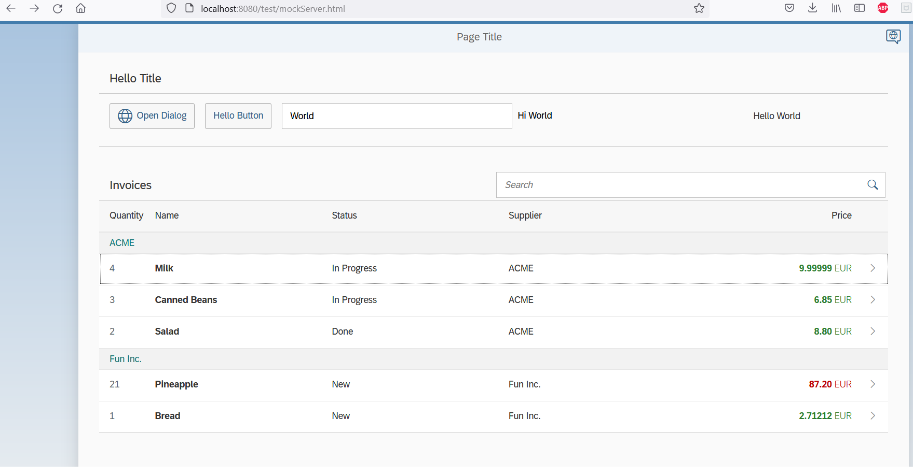

# Recipe creator

## Purpose of the project
To practise with [SAP UI5 development framework] (https://sapui5.hana.ondemand.com/#/topic/3da5f4be63264db99f2e5b04c5e853db.html) to build a demo app based on a Youtube-course: https://www.youtube.com/watch?v=C9cK2Z2JDLg

## How to use the application
User types recipe in the text-file and runs Java programm for example in Command Prompt. Program outputs the Javascript code which can be added as a new recipe directly to the Vegetarian recipe collection application's source code.

## Status of the project
Ready.

## Pictures
