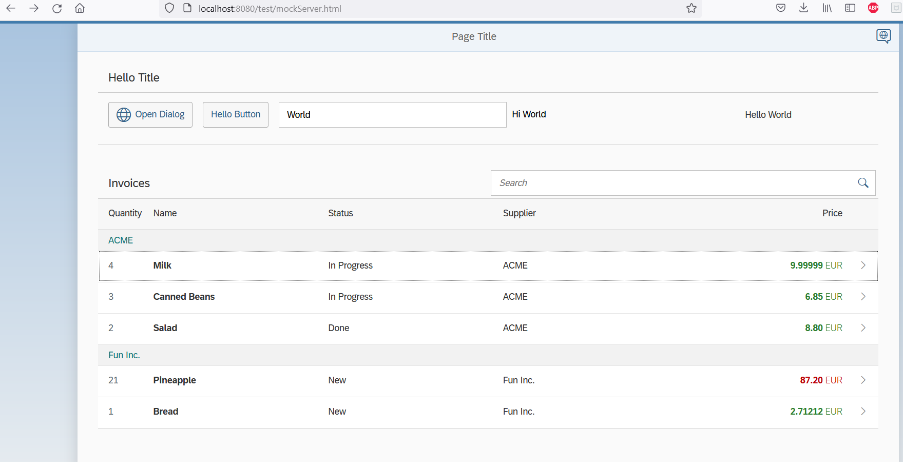

# SAPUI5  Walkthrough 

## Purpose of the project
To practice with [SAPUI5 development framework](https://sapui5.hana.ondemand.com/#/topic/3da5f4be63264db99f2e5b04c5e853db.html) to build a demo app based on a YouTube-course: https://www.youtube.com/watch?v=C9cK2Z2JDLg

## Status of the project
Ready.

## Pictures
