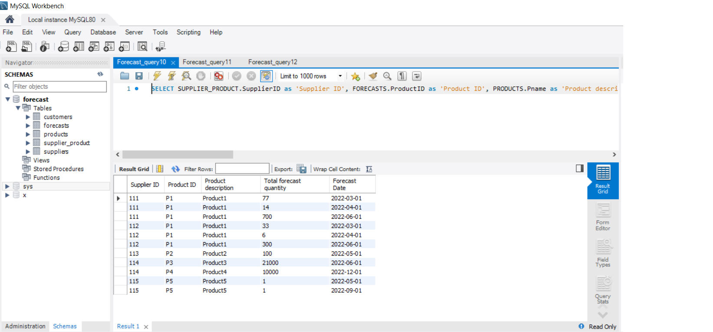
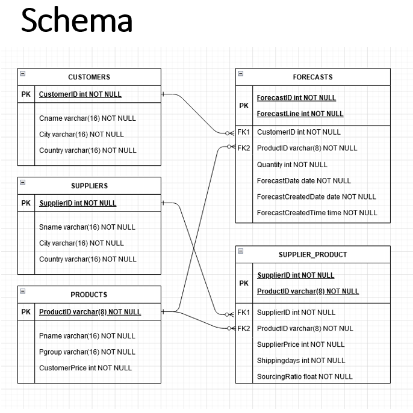

# Database for forecasting

## Purpose of the project
A school project to create SQL database for certain application. The chosen database is for Forecasting application. 

## How to use the application
Database allows user to make different kinds of queries from the database. For example, user can collect data for products, customers and suppliers.

## Status of the project
Ready.

## Pictures

