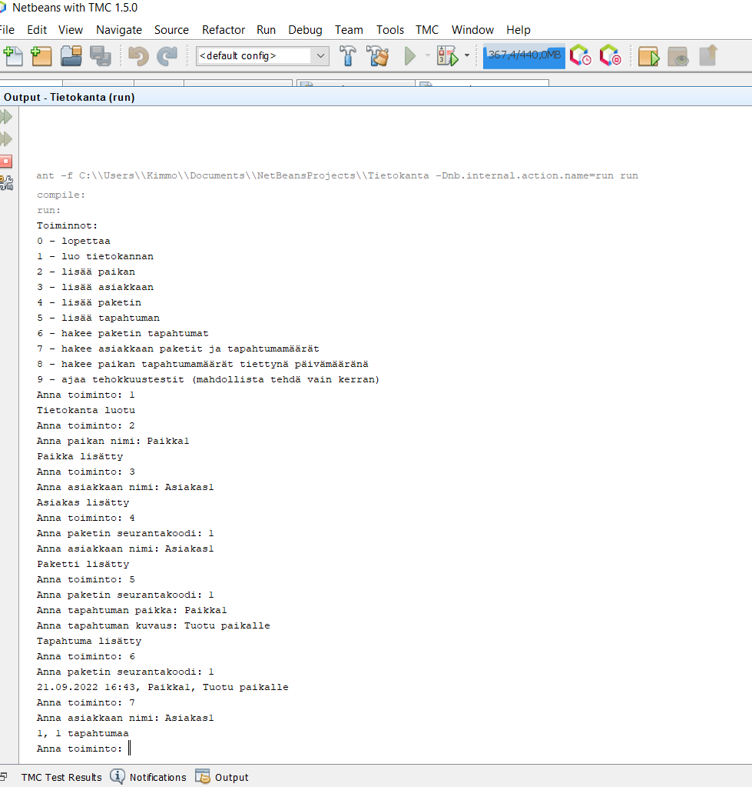
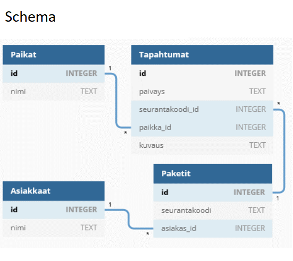

# Database for tracking post packages

## Purpose of the project
A school project to create SQL database for tracking post packages. Programming is based on [SQLite using Java JDBC API](https://www.sqlitetutorial.net/sqlite-java/)

## How to use the application
User can run program for example in NetBeans with TMC to enable get User Interface working. When program is running, it asks commands from user and user can act upon them.

## Status of the project
Ready. School report PDF included in the materials too.

## Pictures

