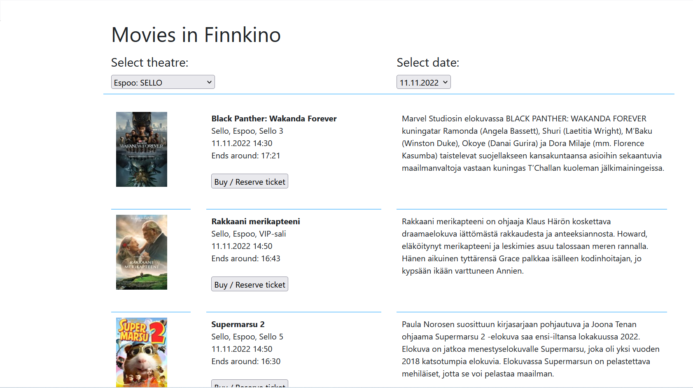
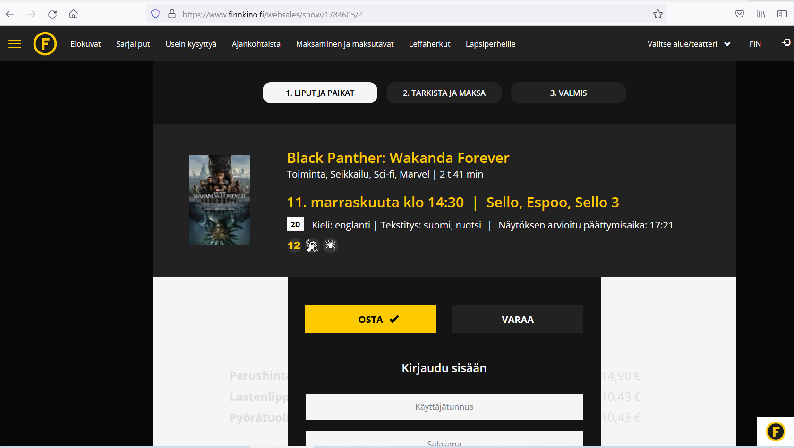

# Movies in Finnkino
Can be found and used at https://kisyys.github.io/movies/.

## Purpose of the project
To show different movies in certain theatres and dates by using Finnkino's API which is based on XML format.

## How to use application
User selects theatre and date and application will show correct results. When clicking the button to buy / reserve ticket, application will direct user to Finnkino site where user can buy or reserve ticket to correct event. 

## Status of the project
Ready to use.

## Pictures

