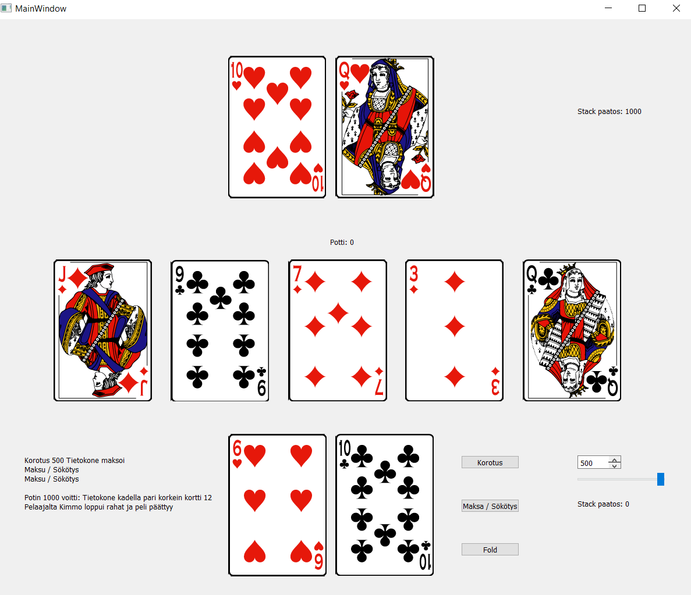

# Texas hold ’em game (in Finnish)
Can be found and used at 

## Purpose of project
To create Texas hold ’em game with Python language.

## Status
Game is not finished but works generally as proof of concept. Development is ongoing.

## Pictures
