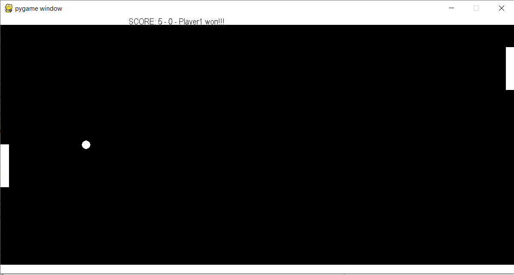

# Pong game
Code is based on Computerphile Youtube channel videos: https://www.youtube.com/playlist?list=PLzH6n4zXuckoUWpzSEpQNW6I8rXIzyi8w

## Purpose of project
To learn to use PyGame library for the game itself and machine learning library for computer player's actions.

## Status
Game is ready. No further development.

## Pictures
