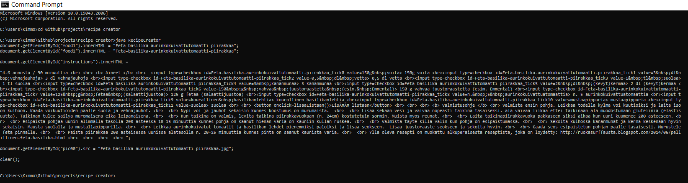

# Recipe creator

## Purpose of the project
To create automatically Javascript / HTML recipe content for [Vegetarian recipe collection application](https://kisyys.github.io/kasvis/) by using text-file.

## How to use the application
User types recipe in the text-file and runs Java programm for example in Command Prompt. Program outputs the Javascript code which can be added as a new recipe directly to the Vegetarian recipe collection application's source code.

## Status of the project
Ready to use.

## Pictures
