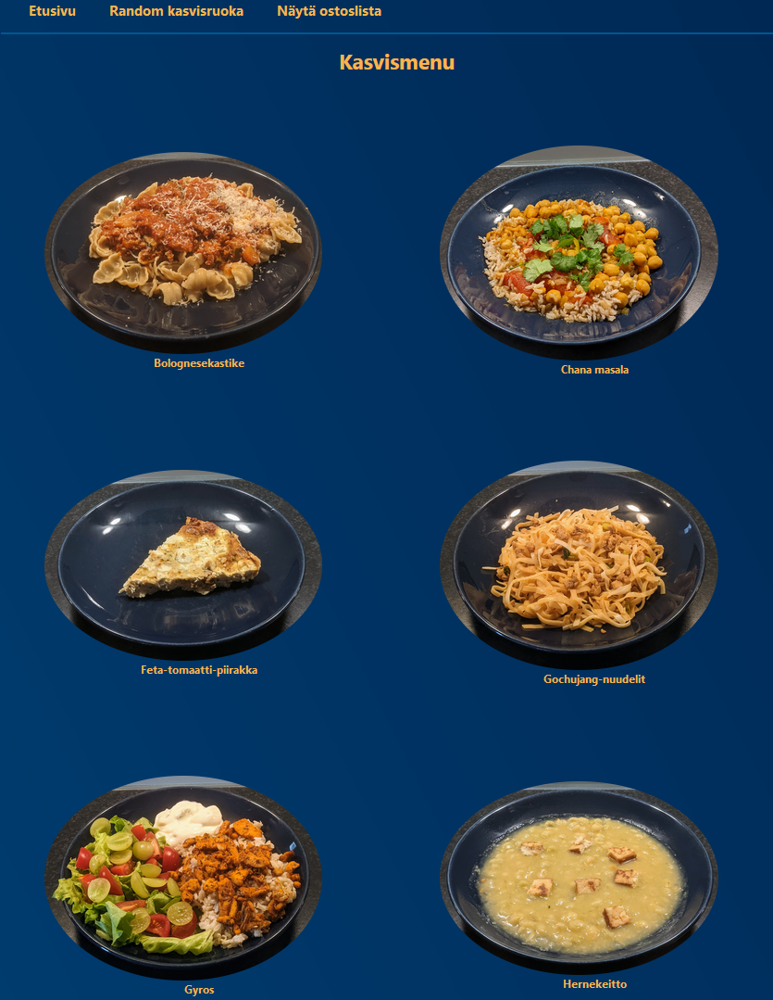

# Vegetarian recipe collection (in Finnish)
Can be found and used at [https://kisyys.github.io/kasvis/](https://kisyys.github.io/kasvis/).

## Purpose of the project
To create vegetarian recipe collection in Finnish by standardising layout for recipes found on the Internet. Design is based on a single-page application (SPA) principle which allows a website to dynamically rewrite the current web page with new data according to user interactions.

## How
User can select the desirable meal from the menu and after clicking the meal, the app will generate the recipe. User can also make shopping list for the missing ingredients.

Also, as an alternative, user can click a random meal, which will randomly generate the recipe for random meal.

## Pics

